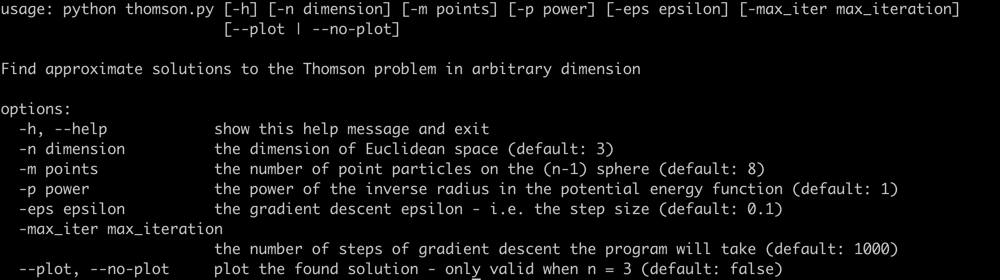

# Readme

## Introduction
This is a simple program that finds numerical approximations to the [Thomson problem](https://en.wikipedia.org/wiki/Thomson_problem), in arbitrary dimensions (the usual Thomson problem is defined for n=3).

If you are only interested in using this, please see the next section. There is a more in depth section further down that outlines how the program works (**spoiler**: gradient descent), and gives some historical context.

**Warning**: The current implementation of gradient descent is very naive (~~this should be read as 'unsophisticated and slow'~~ **update:** it is still unsophisticated, but now less slow), and was built to satisfy my curiosity, not to achieve state of the art results, efficiency, or whatever. I find it fascinating that I can achieve relatively good results (in a sense I will quantify somewhat below) with this naive implementation.

## Getting started

### Requirements

You will need a working install of Python (preferably Python 3), and basic knowledge of the command line.

### Create a virtual environment

You can skip directly to step 4 if you are ok with installing the necessary packages globally on your computer.

1. If you don't have it, install [`virtualenv`](https://pypi.org/project/virtualenv/) with `pip install virtualenv`

2. Create a new virtual environment with e.g. `virtualenv thomson-problem-venv`

3. Activate it with `source thomson-problem-venv/bin/activate`

4. Install the requirements: `pip install -r requirements.txt`

### Running the program

**Example**: `python thomson_problem.py -n 3 -m 10 -eps 0.1`

Run `python thomson_problem.py -h` to display the following help screen:

When the program has finished running it will save the candidate minimal energy configuration to file - you can load it for later use with `np.loadtxt(file_name)`. If the program is taking too long to finish, play around with the step size and number of iterations. It it's still taking too long, you need a better script, computer, or both.

If `n=3` you can also pass `--plot` to the script to view a plot of the solution on the 2-sphere. See below for an example when `m=12`.

## Outline of algorithm

The program is very simple. It generates a random collection of points on an [n-sphere](https://en.wikipedia.org/wiki/Hypersphere), and then runs [gradient descent](https://en.wikipedia.org/wiki/Gradient_descent) on the configuration of the points to lower the total potential energy. That's it. This is much simpler than e.g. calculating the forces between the particles from first principles and then using Newton's laws to update their trajectories until they reach something like a stable state.

Gradient descent is itself interesting - given all the hype around ML/deep learning, I think it is interesting to keep in mind that the 'magic' at the heart of training neural nets is an algorithm that is over 150 years old - according to [this paper](https://www.math.uni-bielefeld.de/documenta/vol-ismp/40_lemarechal-claude.pdf) I found on wikipedia, from a university that probably [doesn't exist](https://en.wikipedia.org/wiki/Bielefeld_conspiracy), [Cauchy](https://en.wikipedia.org/wiki/Augustin-Louis_Cauchy) suggested a version of it in 1847. Of course, these days [more sophisticated](https://en.wikipedia.org/wiki/Stochastic_gradient_descent#Adam) versions of the algorithm are used, on modern hardware, but the basic insight is old.

## About the Thomson problem

The [Thomson problem](https://en.wikipedia.org/wiki/Thomson_problem) is related to the discredited, but historically interesting, [plum pudding model of the atom](https://en.wikipedia.org/wiki/Plum_pudding_model), which we know to be wrong in several ways. Most prominently the model knows nothing about nucleons, and the 'electrons' are treated as classical point particles, e.g. they are not treated quantum mechanically, as we now know they should be. This is not surprising as quantum mechanics had not been invented/discovered when the model was proposed.

I only learnt about the Thomson problem recently (2021), some time after my formal physics education. It drew my attention because it can be viewed purely as an optimisation problem, with no physical content: Given m points in n dimensions, how do we distribute them on the surface of a sphere of dimension (n-1) so that the electrostatic potential energy is minimised?

In principle Thomson could have iterated the gradient descent algorithm by hand (more likely: gotten an assistant/student/[human computer](https://en.wikipedia.org/wiki/Computer#Etymology) to do this) to find acceptable results: For 8 points in 3 dimensions this program usually finds, after only 10 iterations, a potential energy near 19.7 for epsilon=0.1, which is close-ish to the value 19.6752879 listed [here](http://neilsloane.com/electrons/index.html) as a putative minimum (as of March 2021). It would have been tedious, but doable, to calculate this by hand - what they would have done with the value I don't know.

If you are more into using bazookas to kill pigeons, someone implemented a solution to the Thomson problem in Tensorflow for you: [see here](https://towardsdatascience.com/stupid-tensorflow-tricks-3a837194b7a0) - there is a link to a github repo in there too. I'm sure it is at least an order of magnitude faster than this script (at least if you run it on a GPU), at the expense of hiding how the algorithm works, and denying me the pleasure of seeing the numbers come together.

The problem also has interesting relations to [spherical codes](https://en.wikipedia.org/wiki/Spherical_code) (and hence the Kissing Number problem), but I realised if I spent time on implementing solutions to those I would never get around to releasing this, so here you have it. I hope it may be interesting or of use to someone.

## Changing the value of the inverse power of the radial distance

Physically, the inverse square laws of e.g. electrostatics and gravity can be attributed to the density of flux lines (see the Feynman Lectures or [this explanation on physics Stack Exchange](https://physics.stackexchange.com/questions/176811/inverse-square-law-and-extra-space-dimensions)). In higher dimensions we would expect this to lead to a different potential energy function that we would have to minimise. This program allows for something like this by letting you choose p, the inverse power of the radial dependence of the force.

## Ways the current script can be improved

It should be fairly straightforward to build something better from this. If you think something is wrong, or want to improve the code, please create an issue or pull request :D. Here is a list to get you started.

**List of things wrong or missing from the gradient descent implementation:**

1. ~~It's not vectorised~~
2. ~~It iterates over all pairs twice~~
3. There is no momentum parameter
